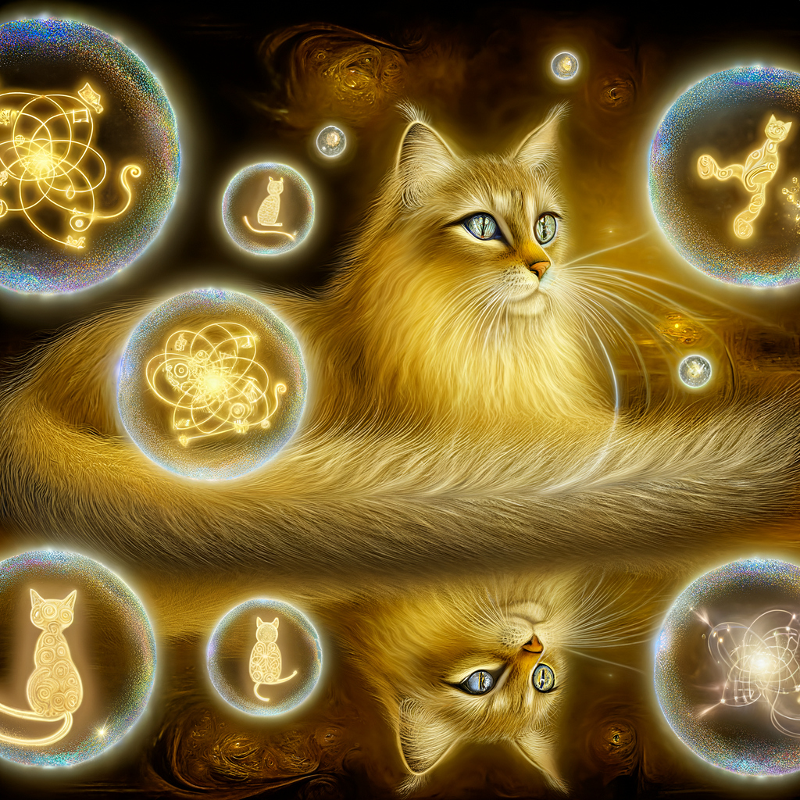

# 🐱 CSMCL Quantum Kitty

A playful quantum-inspired Internet Computer Protocol (ICP) application featuring a kitty that exists in multiple quantum states simultaneously!



## 🌟 About The Project

CSMCL Quantum Kitty is an experimental ICP application that demonstrates the basics of canister development using Rust for the backend and JavaScript for the frontend. The quantum kitty responds with different quantum-themed greetings and exists in various quantum states with fluctuating energy levels.

## 🚀 Features

- **Quantum-Inspired Greetings**: The kitty responds with different quantum-themed messages
- **Quantum States**: The kitty exists in different states (Superposition, Entangled, Coherent, etc.)
- **Energy Levels**: Visual representation of the kitty's quantum energy (1-10)
- **Modern UI**: Clean, responsive interface with animations and visual feedback

## 🛠️ Built With

- **Backend**: Rust + Candid on Internet Computer Protocol
- **Frontend**: JavaScript with lit-html templating
- **Styling**: CSS with animations and gradients

## 🏁 Getting Started

### Prerequisites

- [dfx](https://internetcomputer.org/docs/current/developer-docs/build/install-upgrade-remove) (version 0.27.0 recommended)
- [Rust](https://www.rust-lang.org/tools/install) with wasm32-unknown-unknown target
- [Node.js](https://nodejs.org/) (version 16 or higher)

### Installation

```bash
# Clone the repository
git clone https://github.com/yourusername/csmcl-qkitty.git
cd csmcl-qkitty

# Install Rust target for WebAssembly
rustup target add wasm32-unknown-unknown

# Start the local replica
dfx start --clean --background

# Deploy the project
dfx deploy
```

## 🐾 Waking Up The Quantum Kitty

The quantum kitty starts in a dormant state. Here are ways to wake it up and make it meow differently:

### 1. Change the Greeting Messages

To make the kitty meow with different messages, modify the `quantum_greet` function in `src/csmcl-qkitty-backend/src/lib.rs`:

```rust
// Add or modify the greeting options
let greeting = match random_value {
    0 => format!("Meow there, {}! The quantum kitty purrs in your dimension!", name),
    1 => format!("*quantum paw tap* Hello {}! I exist in multiple states simultaneously!", name),
    2 => format!("Greetings {}! This kitty has folded through spacetime to meet you!", name),
    // Add a new greeting here
    3 => format!("Quantum whiskers twitching... Ah, it's {}! Welcome to my resonance field!", name),
    // And another one
    _ => format!("*Quantum purr* {} has awakened the cosmic kitty consciousness!", name),
};
```

### 2. Add New Quantum States

Expand the possible quantum states by modifying the states array:

```rust
// Add more quantum states
let states = [
    "Superposition", 
    "Entangled", 
    "Coherent", 
    "Resonating", 
    "Folded",
    "Quantum Tunneling",  // New state
    "Wave Collapsed"      // Another new state
];
```

### 3. Add Persistent Memory

Make the kitty remember interactions by adding stable storage:

```rust
use ic_cdk::storage;
use std::cell::RefCell;

#[derive(CandidType, Deserialize, Default)]
struct KittyMemory {
    interaction_count: u64,
    last_visitor: Option<String>,
}

thread_local! {
    static MEMORY: RefCell<KittyMemory> = RefCell::new(KittyMemory::default());
}

#[ic_cdk::update]
fn record_visit(name: String) {
    MEMORY.with(|memory| {
        let mut memory = memory.borrow_mut();
        memory.interaction_count += 1;
        memory.last_visitor = Some(name);
    });
}

#[ic_cdk::query]
fn get_kitty_memory() -> KittyMemory {
    MEMORY.with(|memory| (*memory.borrow()).clone())
}
```

### 4. Add Time-Based Behavior

Make the kitty behave differently based on time of day:

```rust
// Get the current hour (0-23)
let now = SystemTime::now().duration_since(UNIX_EPOCH).unwrap();
let seconds_in_day = now.as_secs() % 86400;
let hour = (seconds_in_day / 3600) as u8;

// Morning, afternoon, evening, night behaviors
let time_behavior = if hour >= 5 && hour < 12 {
    "The quantum kitty is energetic and playful in the morning light!"
} else if hour >= 12 && hour < 18 {
    "The quantum kitty is sunbathing and contemplating quantum physics."
} else if hour >= 18 && hour < 22 {
    "The quantum kitty is in hunting mode, chasing quantum particles."
} else {
    "The quantum kitty is dreaming in multiple dimensions simultaneously."
};
```

### 5. Add Interactive Elements

Enhance the frontend to allow more interactions:

```javascript
// Add a pet function to the App class
petKitty = async () => {
  const response = await csmcl_qkitty_backend.pet_kitty();
  this.purr = response.purr;
  this.happiness = response.happiness;
  this.#render();
};

// Add a button in the template
html`
  <button @click=${() => this.petKitty()} class="pet-button">
    Pet the Quantum Kitty
  </button>
`
```

## 🌌 Understanding the Quantum Kitty

For a deeper understanding of the project:

- Read [CSMCL-QUANTUM-KITTY-GUIDE.md](./CSMCL-QUANTUM-KITTY-GUIDE.md) for a comprehensive overview
- Check [ICP-DECLARATIONS-EXPLAINED.md](./ICP-DECLARATIONS-EXPLAINED.md) to understand how frontend-backend communication works

## 📝 License

This project is licensed under the MIT License - see the LICENSE file for details.

## 🙏 Acknowledgements

- [Internet Computer Protocol](https://internetcomputer.org/) for the platform
- [DFINITY](https://dfinity.org/) for the development tools
- Quantum physics for the inspiration

---

*The quantum kitty exists in a superposition of states until you interact with it. What state will you find it in?*